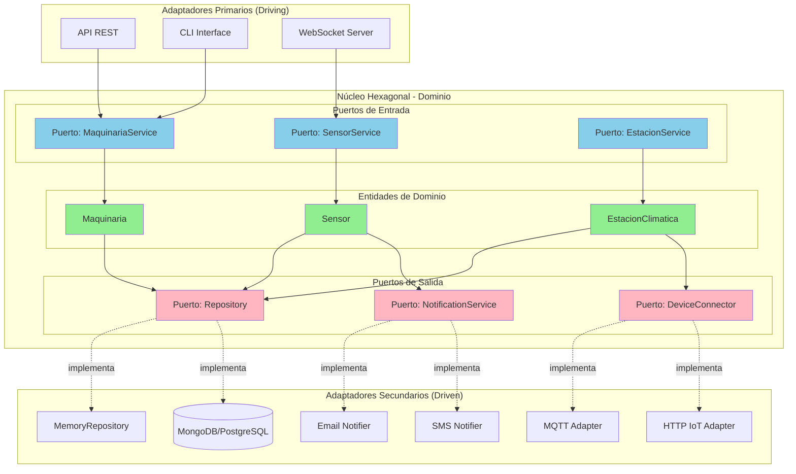

# ADR-003: Selección de Patrón Arquitectónico para Sistema AgroTech

## Estado

Aceptado

## Fecha

24 de febrero de 2026

## Contexto

### Descripción del Dominio

Sistema de gestión de recursos AgroTech que permite administrar maquinaria agrícola compartida, sensores ambientales y estaciones climáticas. El sistema debe procesar datos en tiempo real de múltiples dispositivos IoT distribuidos geográficamente y coordinar el uso eficiente de recursos agrícolas.

### Requisitos Identificados

**Funcionales**:
- Registro y gestión de maquinaria agrícola
- Monitoreo de sensores ambientales en tiempo real
- Gestión de estaciones climáticas
- Consulta de disponibilidad de recursos
- Historial de uso y mantenimiento
- Alertas basadas en condiciones ambientales

**No Funcionales**:

| Requisito      | Nivel Requerido | Justificación                                                                                          |
| -------------- | --------------- | ------------------------------------------------------------------------------------------------------ |
| Escalabilidad  | Alto            | Crecimiento de sensores IoT y maquinaria. Puede pasar de 100 a 10,000+ dispositivos                   |
| Performance    | Alto            | Datos de sensores en tiempo real requieren procesamiento rápido (<2s respuesta)                        |
| Mantenibilidad | Alto            | Equipo pequeño necesita código claro. Funcionalidades evolucionan constantemente                       |
| Disponibilidad | Medio           | Operaciones agrícolas toleran breves interrupciones, pero datos críticos deben estar accesibles 99%    |
| Seguridad      | Medio-Alto      | Protección de datos operativos y control de acceso a maquinaria costosa                                |

### Restricciones

- **Equipo**: 2-3 desarrolladores con experiencia media en JavaScript
- **Tiempo**: 6 meses para MVP funcional
- **Presupuesto**: Limitado - preferencia por soluciones open source
- **Tecnología**: JavaScript ES2023, Node.js, arquitectura modular

## Opciones Evaluadas

### Opción 1: Arquitectura en Capas (Layered Architecture)

**Descripción**: Organización horizontal del sistema en capas: Presentación, Negocio, Persistencia y Base de Datos. Cada capa solo puede comunicarse con la inmediatamente inferior.

**Pros**:
- Separación clara de responsabilidades
- Fácil de entender para equipos pequeños
- Patrón bien documentado y conocido
- Bajo costo de implementación inicial

**Contras**:
- Acoplamiento vertical entre capas
- Dificulta escalabilidad horizontal
- Cambios transversales afectan múltiples capas
- No ideal para sistemas distribuidos con IoT

### Opción 2: Arquitectura Hexagonal (Ports & Adapters)

**Descripción**: El dominio de negocio está en el centro, aislado de detalles técnicos mediante puertos (interfaces) y adaptadores (implementaciones). Permite múltiples interfaces de entrada/salida.

**Pros**:
- Dominio completamente independiente de infraestructura
- Fácil testing con mocks
- Flexibilidad para cambiar tecnologías (BD, APIs, sensores)
- Excelente mantenibilidad a largo plazo
- Se adapta bien a sistemas IoT con múltiples fuentes de datos

**Contras**:
- Curva de aprendizaje inicial más alta
- Más código boilerplate (interfaces, adaptadores)
- Puede ser over-engineering para sistemas muy simples
- Requiere disciplina del equipo

### Opción 3: Arquitectura Basada en Eventos (Event-Driven)

**Descripción**: Los componentes se comunican mediante eventos asíncronos. Productores emiten eventos y consumidores reaccionan a ellos sin acoplamiento directo.

**Pros**:
- Excelente para datos en tiempo real de sensores
- Alta escalabilidad y desacoplamiento
- Procesamiento asíncrono natural para IoT
- Facilita integración de nuevos dispositivos

**Contras**:
- Complejidad en debugging y trazabilidad
- Requiere infraestructura adicional (message broker)
- Curva de aprendizaje pronunciada
- Difícil garantizar consistencia de datos
- Overhead para equipo pequeño

## Decisión

Hemos decidido usar **Arquitectura Hexagonal (Ports & Adapters)** para el sistema AgroTech.

### Justificación Principal

La arquitectura hexagonal es ideal para nuestro contexto porque:

1. **Aislamiento del dominio**: La lógica de negocio agrícola (maquinaria, sensores, estaciones) permanece pura y testeable, independiente de cómo se almacenan los datos o de qué protocolos IoT usamos.

2. **Flexibilidad tecnológica**: Podemos empezar con repositorios en memoria y migrar a MongoDB, PostgreSQL o bases de datos de series temporales sin tocar el dominio.

3. **Múltiples adaptadores**: Necesitamos conectar diversos dispositivos IoT (MQTT, HTTP, WebSockets) y la arquitectura hexagonal facilita crear adaptadores específicos para cada protocolo.

4. **Mantenibilidad**: Con un equipo pequeño, tener el dominio claramente separado facilita que cualquier desarrollador entienda la lógica de negocio sin perderse en detalles técnicos.

5. **Continuidad con Semanas 01-02**: Ya implementamos interfaces (repository.js) y separación de capas que se alinean perfectamente con este patrón.

### Resultado de la Matriz de Decisión

| Criterio                          | Peso | Capas | Hexagonal | Eventos |
| --------------------------------- | :--: | :---: | :-------: | :-----: |
| Mantenibilidad                    | 25%  | 3×25=75 | 5×25=125 | 2×25=50 |
| Flexibilidad tecnológica          | 20%  | 2×20=40 | 5×20=100 | 4×20=80 |
| Facilidad de testing              | 20%  | 3×20=60 | 5×20=100 | 3×20=60 |
| Curva de aprendizaje              | 15%  | 5×15=75 | 3×15=45  | 2×15=30 |
| Escalabilidad                     | 10%  | 2×10=20 | 4×10=40  | 5×10=50 |
| Adecuación para IoT               | 10%  | 2×10=20 | 4×10=40  | 5×10=50 |
| **TOTAL**                         | 100% | **290** | **450** | **320** |

**Ganador**: Arquitectura Hexagonal con 450 puntos

## Consecuencias

### Positivas

- **Testabilidad superior**: Podemos probar la lógica de negocio sin levantar servidores ni bases de datos
- **Evolución controlada**: Agregar nuevos tipos de sensores o protocolos IoT no afecta el core del sistema
- **Independencia de frameworks**: No quedamos atados a Express, Fastify u otro framework específico
- **Documentación implícita**: Los puertos (interfaces) documentan claramente qué necesita el dominio
- **Reutilización**: La lógica de dominio puede usarse desde CLI, API REST, WebSockets, etc.

### Negativas (Trade-offs Aceptados)

- **Más archivos iniciales**: Necesitamos crear interfaces y adaptadores, aumentando la estructura inicial
- **Abstracción adicional**: El equipo debe entender el concepto de puertos y adaptadores
- **Posible over-engineering**: Para funcionalidades muy simples, puede parecer excesivo

### Riesgos y Mitigación

| Riesgo                                      | Probabilidad | Impacto | Mitigación                                                                                    |
| ------------------------------------------- | :----------: | :-----: | --------------------------------------------------------------------------------------------- |
| Equipo no comprende el patrón               |    Medio     |  Alto   | Sesión de capacitación + documentación clara + code reviews                                  |
| Exceso de abstracción ralentiza desarrollo  |    Medio     |  Medio  | Empezar simple, agregar abstracciones solo cuando hay múltiples implementaciones             |
| Dificultad para nuevos desarrolladores      |     Bajo     |  Medio  | README detallado + diagramas + ejemplos de cómo agregar nuevos adaptadores                   |

## Diagrama de Arquitectura

### Explicación del Diagrama

**Capa Central (Dominio)**:
- Entidades: Maquinaria, Sensor, EstacionClimatica
- Puertos de entrada: Servicios que exponen la lógica de negocio
- Puertos de salida: Interfaces que el dominio necesita (persistencia, notificaciones, conectividad IoT)

**Adaptadores Primarios (Izquierda/Arriba)**:
- API REST: Para aplicaciones web/móviles
- CLI: Para administración y scripts
- WebSocket: Para datos en tiempo real

**Adaptadores Secundarios (Derecha/Abajo)**:
- Repositorios: MemoryRepository (actual), MongoDB/PostgreSQL (futuro)
- Conectores IoT: MQTT para sensores, HTTP para APIs de dispositivos
- Notificaciones: Email, SMS para alertas

**Flujo de Datos**:
1. Cliente hace petición → Adaptador Primario
2. Adaptador llama → Puerto de Entrada (Service)
3. Service ejecuta lógica → Entidades de Dominio
4. Dominio necesita persistencia → Puerto de Salida (Repository)
5. Puerto de Salida → Adaptador Secundario (implementación concreta)

## Notas Adicionales

### Próximos Pasos (Semana 04)

1. **Diseñar API REST** siguiendo el patrón hexagonal
2. **Definir contratos de puertos** para sensores IoT
3. **Crear adaptador MQTT** para comunicación con dispositivos
4. **Implementar validaciones** en capa de dominio
5. **Agregar casos de uso** complejos (reserva de maquinaria, alertas automáticas)

### Referencias

- **Artículos**:
  - [Hexagonal Architecture by Alistair Cockburn](https://alistair.cockburn.us/hexagonal-architecture/)
  - [Ports and Adapters Pattern](https://herbertograca.com/2017/09/14/ports-adapters-architecture/)

- **Casos de Éxito**:
  - Netflix: Usa arquitectura hexagonal para servicios de streaming
  - Sistemas IoT industriales con múltiples protocolos de comunicación

**Proyecto Integrador - Semana 03**  
Tecnólogo ADSO - SENA Bogotá  
Competencia: Arquitectura de Software  

