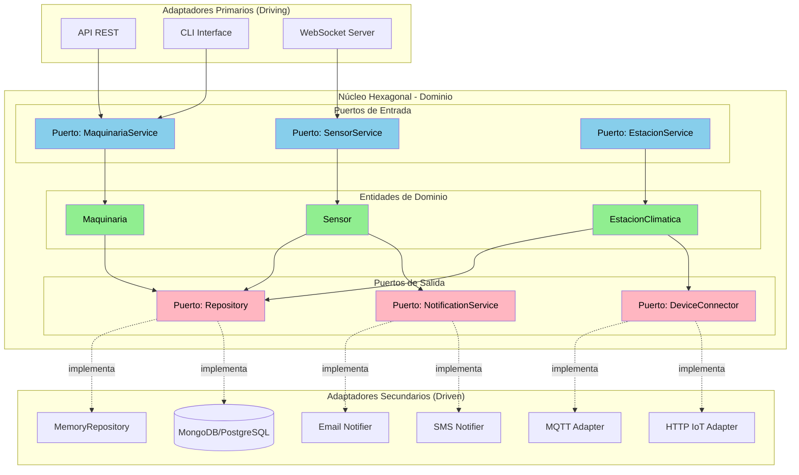

# Diagrama de Arquitectura Hexagonal - Sistema AgroTech

## Vista de Alto Nivel



## Componentes Principales del Sistema

### 1. Adaptadores Primarios (Entrada)

Son las interfaces que permiten a los usuarios y sistemas externos interactuar con nuestra aplicación:

- **API REST**: Para aplicaciones web y móviles
- **CLI (Línea de Comandos)**: Para administradores del sistema
- **WebSocket**: Para recibir datos en tiempo real de los sensores

### 2. Núcleo del Dominio (Lógica de Negocio)

Es el corazón del sistema donde está toda la lógica del negocio agrícola:

**Entidades:**
- **Maquinaria**: Tractores, drones, sembradoras
- **Sensor**: Dispositivos que miden temperatura, humedad, CO₂
- **EstacionClimatica**: Estaciones que agrupan varios sensores

**Servicios (Puertos de Entrada):**
- **MaquinariaService**: Crear, listar y actualizar maquinaria
- **SensorService**: Gestionar sensores y sus lecturas
- **EstacionService**: Administrar estaciones climáticas

**Interfaces (Puertos de Salida):**
- **Repository**: Para guardar y consultar datos
- **NotificationService**: Para enviar alertas
- **DeviceConnector**: Para conectar con dispositivos IoT

### 3. Adaptadores Secundarios (Salida)

Son las implementaciones concretas que conectan con servicios externos:

- **MemoryRepository**: Almacenamiento temporal en memoria (para desarrollo)
- **MongoDB/PostgreSQL**: Bases de datos para producción
- **MQTT Adapter**: Protocolo para comunicación con sensores IoT
- **HTTP Adapter**: Para consultar APIs externas
- **Email/SMS Notifier**: Para enviar notificaciones

## Capas según el Patrón Hexagonal

```
┌─────────────────────────────────────────────────┐
│         ADAPTADORES PRIMARIOS                   │
│  (Reciben peticiones del exterior)              │
│                                                 │
│  ┌──────────┐  ┌──────────┐  ┌──────────┐     │
│  │ API REST │  │   CLI    │  │WebSocket │     │
│  └────┬─────┘  └────┬─────┘  └────┬─────┘     │
│       │             │             │            │
│       └─────────────┴─────────────┘            │
└─────────────────────┼──────────────────────────┘
                      ▼
┌─────────────────────────────────────────────────┐
│            NÚCLEO HEXAGONAL                     │
│         (Lógica de Negocio Pura)                │
│                                                 │
│  ┌──────────────────────────────────────┐       │
│  │ Servicios (Puertos de Entrada)      │       │
│  │ - MaquinariaService                 │       │
│  │ - SensorService                     │       │
│  └──────────────────────────────────────┘       │
│                                                 │
│  ┌──────────────────────────────────────┐       │
│  │ Entidades de Dominio                │       │
│  │ - Maquinaria, Sensor, Estación      │       │
│  └──────────────────────────────────────┘       │
│                                                 │
│  ┌──────────────────────────────────────┐       │
│  │ Interfaces (Puertos de Salida)      │       │
│  │ - Repository, Notifications, IoT    │       │
│  └──────────────────────────────────────┘       │
└─────────────────────┬───────────────────────────┘
                      ▼
┌─────────────────────────────────────────────────┐
│        ADAPTADORES SECUNDARIOS                  │
│  (Implementaciones de servicios externos)       │
│                                                 │
│  ┌──────────┐  ┌──────────┐  ┌──────────┐     │
│  │ MongoDB  │  │   MQTT   │  │  Email   │     │
│  │   Repo   │  │ Adapter  │  │ Notifier │     │
│  └──────────┘  └──────────┘  └──────────┘     │
└─────────────────────────────────────────────────┘
```

## Flujo de Datos entre Componentes

### Ejemplo: Registrar una nueva maquinaria

```
1. Usuario envía petición HTTP
   │
   ├─→ POST /api/maquinaria
   │   Body: { nombre: "Tractor John Deere", tipo: "tractor" }
   │
   ▼
2. API REST Adapter (Adaptador Primario)
   │
   ├─→ Recibe la petición
   ├─→ Valida los datos básicos
   │
   ▼
3. MaquinariaService (Puerto de Entrada)
   │
   ├─→ Aplica reglas de negocio
   ├─→ Valida que el nombre no esté vacío
   ├─→ Crea la entidad Maquinaria
   │
   ▼
4. Entidad Maquinaria
   │
   ├─→ Objeto con los datos validados
   │
   ▼
5. Repository (Puerto de Salida)
   │
   ├─→ Llama al método save()
   │
   ▼
6. MongoDBRepository (Adaptador Secundario)
   │
   ├─→ Guarda en la base de datos MongoDB
   ├─→ Retorna la maquinaria guardada
   │
   ▼
7. Respuesta al usuario
   └─→ 201 Created + JSON con los datos de la maquinaria
```

## Integraciones Externas

El sistema se conecta con servicios externos a través de los adaptadores secundarios:

### Bases de Datos (BD)
- **MongoDB**: Base de datos NoSQL para almacenar maquinaria, sensores y estaciones
- **PostgreSQL**: Alternativa de base de datos relacional

### APIs Externas
- **API del Clima**: Para obtener datos meteorológicos (OpenWeatherMap)
- **API de Fabricantes**: Para consultar especificaciones técnicas de maquinaria
- **Broker MQTT**: Para comunicación en tiempo real con sensores IoT

### Servicios Externos
- **Servicio de Email (SMTP)**: Para enviar notificaciones por correo
- **Servicio de SMS (Twilio)**: Para alertas urgentes por mensaje de texto
- **Servicio de Autenticación**: Para login seguro de usuarios


## Beneficios de Esta Arquitectura

### 1. Independencia Tecnológica
Podemos cambiar tecnologías sin afectar el núcleo:
- Cambiar de MongoDB a PostgreSQL
- Cambiar de Express a Fastify
- Agregar nuevos protocolos IoT

### 2. Fácil de Probar (Testing)
Podemos probar la lógica de negocio sin necesidad de:
- Levantar una base de datos
- Conectar sensores reales
- Enviar emails reales

### 3. Mantenible
- El código está organizado y es fácil de entender
- Cada parte tiene una responsabilidad clara
- Nuevos desarrolladores pueden entender rápido el sistema

### 4. Escalable
- Podemos agregar nuevos adaptadores sin tocar el núcleo
- Cada componente puede crecer independientemente


**Proyecto Integrador - Semana 03**  
Tecnólogo ADSO - SENA Bogotá  
Competencia: Arquitectura de Software  

