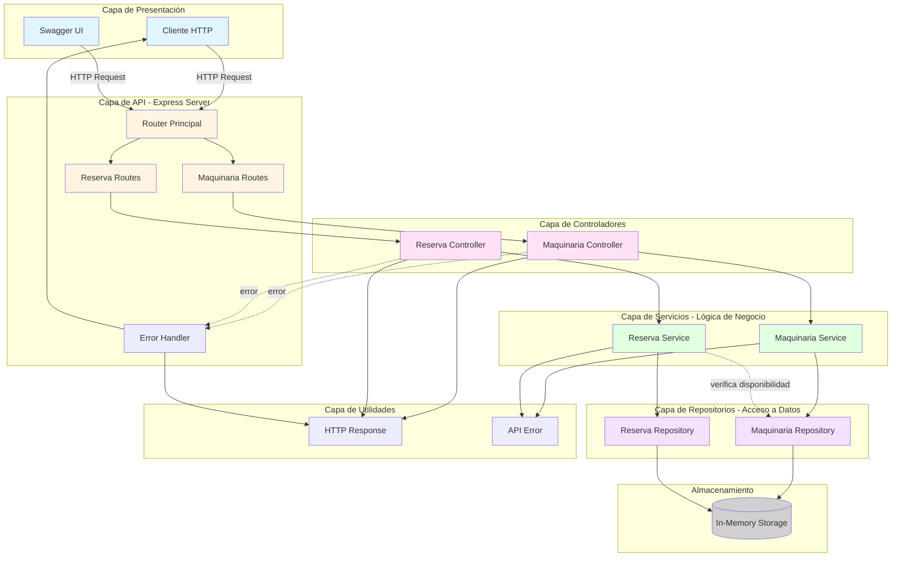
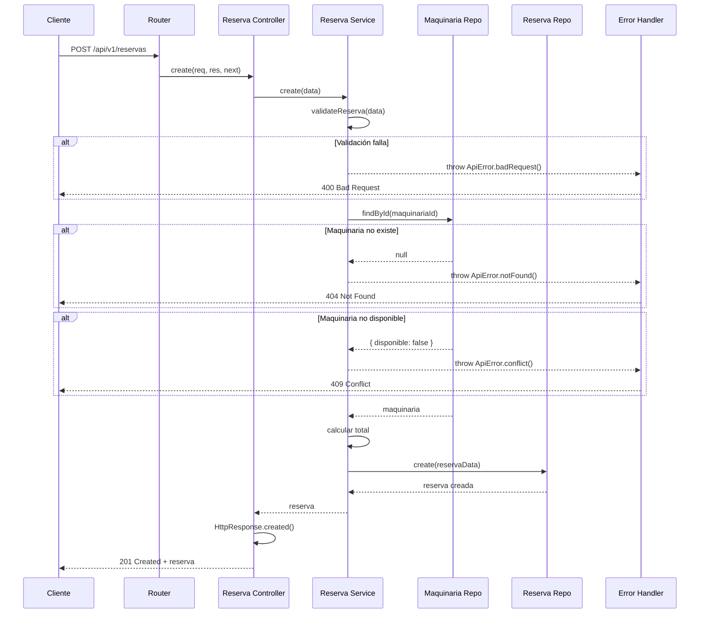

# Diagrama de Componentes - AgroTech API

## Vista de Alto Nivel



## Descripción de Componentes

### 1. Capa de Presentación

#### Cliente HTTP
- **Responsabilidad**: Consumir la API REST
- **Tecnología**: Cualquier cliente HTTP (Postman, curl, navegador, aplicación móvil)
- **Interfaces**: HTTP/HTTPS

#### Swagger UI
- **Responsabilidad**: Documentación interactiva de la API
- **Tecnología**: swagger-ui-express
- **Endpoint**: `/api-docs`

### 2. Capa de API (Express Server)

#### Router Principal
- **Responsabilidad**: Enrutamiento de peticiones HTTP
- **Archivo**: `src/index.js`
- **Funciones**:
  - Configurar middleware global
  - Registrar rutas de recursos
  - Configurar Swagger
  - Aplicar error handler

#### Maquinaria Routes
- **Responsabilidad**: Definir endpoints de maquinaria
- **Archivo**: `src/routes/maquinaria.routes.js`
- **Endpoints**:
  - `GET /api/v1/maquinaria` - Listar
  - `GET /api/v1/maquinaria/:id` - Obtener por ID
  - `POST /api/v1/maquinaria` - Crear
  - `PUT /api/v1/maquinaria/:id` - Actualizar completo
  - `PATCH /api/v1/maquinaria/:id` - Actualizar parcial
  - `DELETE /api/v1/maquinaria/:id` - Eliminar

#### Reserva Routes
- **Responsabilidad**: Definir endpoints de reservas
- **Archivo**: `src/routes/reserva.routes.js`
- **Endpoints**:
  - `GET /api/v1/reservas` - Listar
  - `GET /api/v1/reservas/:id` - Obtener por ID
  - `POST /api/v1/reservas` - Crear
  - `PATCH /api/v1/reservas/:id` - Actualizar estado

#### Error Handler
- **Responsabilidad**: Manejo centralizado de errores
- **Archivo**: `src/middleware/error-handler.js`
- **Funciones**:
  - Capturar errores de toda la aplicación
  - Formatear respuestas de error
  - Logging de errores

### 3. Capa de Controladores

#### Maquinaria Controller
- **Responsabilidad**: Manejar peticiones HTTP de maquinaria
- **Archivo**: `src/controllers/maquinaria.controller.js`
- **Funciones**:
  - Extraer parámetros de request
  - Llamar servicios de negocio
  - Formatear respuestas HTTP
  - Pasar errores al error handler

#### Reserva Controller
- **Responsabilidad**: Manejar peticiones HTTP de reservas
- **Archivo**: `src/controllers/reserva.controller.js`
- **Funciones**:
  - Extraer parámetros de request
  - Llamar servicios de negocio
  - Formatear respuestas HTTP
  - Pasar errores al error handler

### 4. Capa de Servicios (Lógica de Negocio)

#### Maquinaria Service
- **Responsabilidad**: Lógica de negocio de maquinaria
- **Archivo**: `src/services/maquinaria.service.js`
- **Funciones**:
  - Validar datos de entrada
  - Aplicar reglas de negocio
  - Coordinar operaciones con repositorios
  - Implementar paginación y filtros
  - Lanzar errores de negocio

#### Reserva Service
- **Responsabilidad**: Lógica de negocio de reservas
- **Archivo**: `src/services/reserva.service.js`
- **Funciones**:
  - Validar datos de reserva
  - Verificar disponibilidad de maquinaria
  - Calcular costos totales
  - Gestionar estados de reserva
  - Coordinar con múltiples repositorios

### 5. Capa de Repositorios (Acceso a Datos)

#### Maquinaria Repository
- **Responsabilidad**: Persistencia de maquinaria
- **Archivo**: `src/repositories/maquinaria.repository.js`
- **Funciones**:
  - CRUD básico
  - Filtrado de datos
  - Conteo de registros
  - Gestión de datos en memoria

#### Reserva Repository
- **Responsabilidad**: Persistencia de reservas
- **Archivo**: `src/repositories/reserva.repository.js`
- **Funciones**:
  - CRUD básico
  - Filtrado por maquinaria, usuario, estado
  - Conteo de registros
  - Gestión de datos en memoria

### 6. Capa de Utilidades

#### HTTP Response
- **Responsabilidad**: Estandarizar respuestas HTTP
- **Archivo**: `src/utils/http-response.js`
- **Funciones**:
  - Formatear respuestas exitosas
  - Formatear respuestas con paginación
  - Formatear respuestas de error
  - Agregar timestamps

#### API Error
- **Responsabilidad**: Manejo de errores personalizados
- **Archivo**: `src/utils/api-error.js`
- **Funciones**:
  - Crear errores con código de estado
  - Errores predefinidos (400, 404, 409, 500)
  - Incluir detalles de validación

### 7. Almacenamiento

#### In-Memory Storage
- **Responsabilidad**: Almacenamiento temporal de datos
- **Tecnología**: Map de JavaScript
- **Características**:
  - Datos iniciales precargados
  - Persistencia durante ejecución
  - Fácil migración a BD real

## Flujo de Datos

### Ejemplo: Crear una Reserva



## Interfaces Públicas

### Maquinaria Controller
```javascript
class MaquinariaController {
  async getAll(req, res, next)
  async getById(req, res, next)
  async create(req, res, next)
  async update(req, res, next)
  async partialUpdate(req, res, next)
  async delete(req, res, next)
}
```

### Maquinaria Service
```javascript
class MaquinariaService {
  findAll(filters, page, limit)
  findById(id)
  create(data)
  update(id, data)
  partialUpdate(id, data)
  delete(id)
  validateMaquinaria(data)
}
```

### Maquinaria Repository
```javascript
class MaquinariaRepository {
  findAll(filters)
  findById(id)
  create(data)
  update(id, data)
  delete(id)
  count(filters)
}
```

## Dependencias entre Componentes

| Componente           | Depende de                                    |
| -------------------- | --------------------------------------------- |
| Router               | Routes, Error Handler, Swagger                |
| Routes               | Controllers                                   |
| Controllers          | Services, HTTP Response                       |
| Services             | Repositories, API Error                       |
| Repositories         | In-Memory Storage                             |
| Error Handler        | HTTP Response, API Error                      |

## Principios Aplicados

### Separación de Responsabilidades
- Cada capa tiene una responsabilidad clara
- Controllers: HTTP
- Services: Lógica de negocio
- Repositories: Persistencia

### Inversión de Dependencias
- Services dependen de abstracciones (interfaces de repositorios)
- Fácil cambiar implementación de persistencia

### Single Responsibility
- Cada clase tiene una única razón para cambiar
- Validación en Services
- Formateo en Controllers
- Persistencia en Repositories

### Open/Closed
- Fácil agregar nuevos recursos sin modificar existentes
- Nuevo recurso = nuevo route + controller + service + repository

## Escalabilidad Futura

### Migración a Base de Datos Real
1. Crear nuevas implementaciones de repositorios (PostgreSQL, MongoDB)
2. Inyectar nueva implementación en services
3. No tocar controllers ni routes

### Agregar Autenticación
1. Crear middleware de autenticación
2. Aplicar en routes específicas
3. No modificar lógica de negocio

### Agregar Caché
1. Crear capa de caché entre service y repository
2. Implementar estrategia de invalidación
3. Transparente para controllers

---

**Nota**: Este diagrama representa la arquitectura implementada en la Semana 04 del proyecto AgroTech, siguiendo el patrón de arquitectura en capas con separación clara de responsabilidades.
