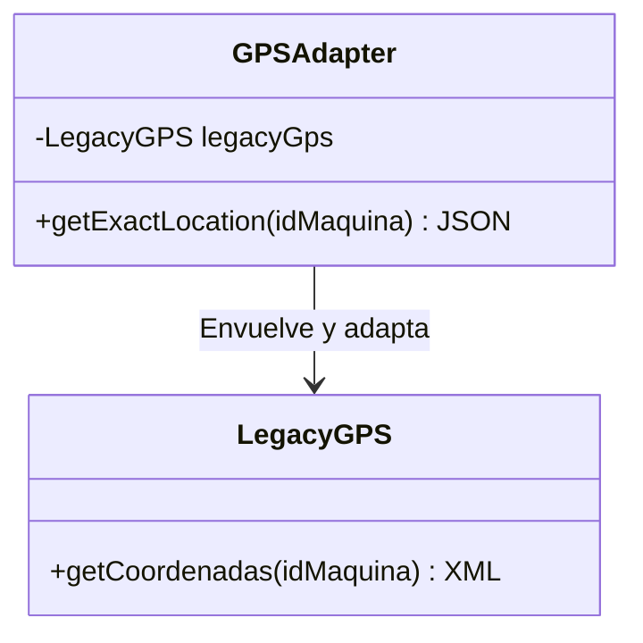

```mermaid
classDiagram
    class GPSAdapter {
        -LegacyGPS legacyGps
        +getExactLocation(idMaquina) JSON
    }
    class LegacyGPS {
        +getCoordenadas(idMaquina) XML
    }
    GPSAdapter --> LegacyGPS : Envuelve y adapta
```
