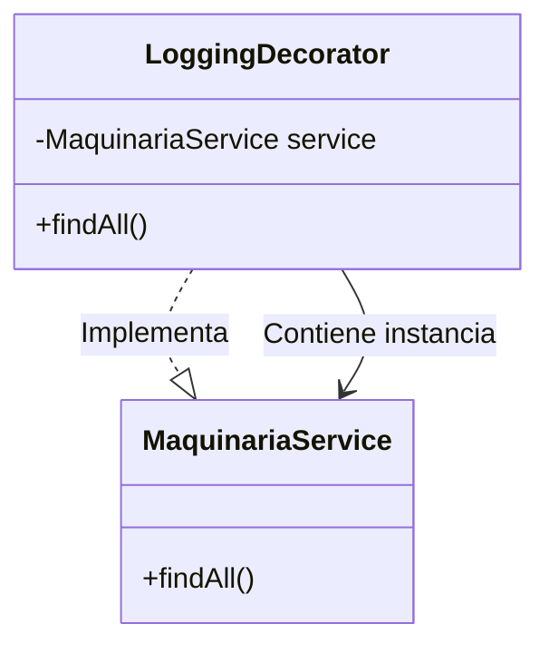

```mermaid
classDiagram
    class MaquinariaService {
        +findAll()
    }
    class LoggingDecorator {
        -MaquinariaService service
        +findAll()
    }
    LoggingDecorator ..|> MaquinariaService : Implementa
    LoggingDecorator --> MaquinariaService : Contiene instancia
```
