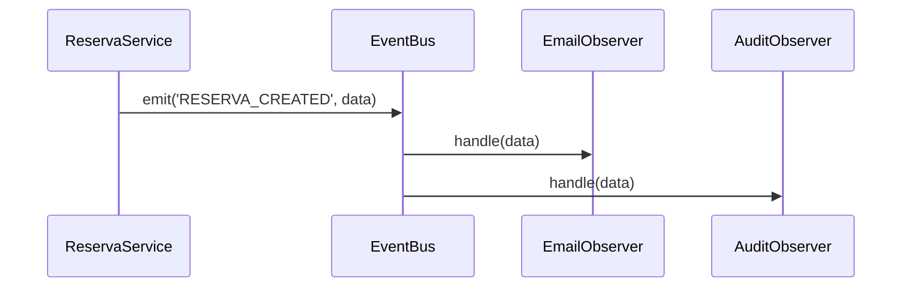

```mermaid
sequenceDiagram
    participant S as ReservaService
    participant E as EventBus
    participant O1 as EmailObserver
    participant O2 as AuditObserver
    S->>E: emit('RESERVA_CREATED', data)
    E->>O1: handle(data)
    E->>O2: handle(data)
```
