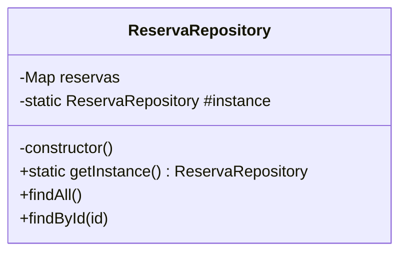

```mermaid
classDiagram
    class ReservaRepository {
        -Map reservas
        -static ReservaRepository #instance
        -constructor()
        +static getInstance() ReservaRepository
        +findAll()
        +findById(id)
    }
```
