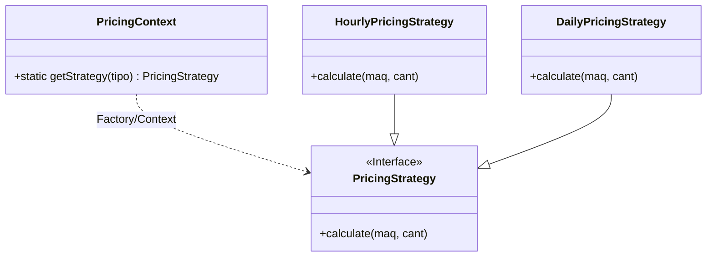

```mermaid
classDiagram
    class PricingContext {
        +static getStrategy(tipo) PricingStrategy
    }
    class PricingStrategy {
        <<Interface>>
        +calculate(maq, cant)
    }
    class HourlyPricingStrategy {
        +calculate(maq, cant)
    }
    class DailyPricingStrategy {
        +calculate(maq, cant)
    }
    PricingContext ..> PricingStrategy : Factory/Context
    HourlyPricingStrategy --|> PricingStrategy
    DailyPricingStrategy --|> PricingStrategy
```
